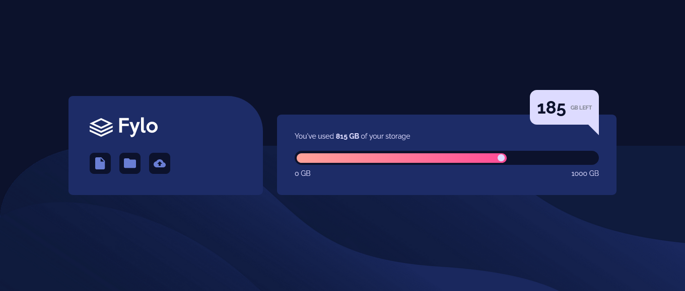

# Frontend Mentor - Fylo data storage component solution

This is a solution to the [Fylo data storage component challenge on Frontend Mentor](https://www.frontendmentor.io/challenges/fylo-data-storage-component-1dZPRbV5n). Frontend Mentor challenges help you improve your coding skills by building realistic projects.

## Table of contents

- [Overview](#overview)
  - [The challenge](#the-challenge)
  - [Screenshot](#screenshot)
  - [Links](#links)
- [My process](#my-process)
  - [Built with](#built-with)
  - [What I learned](#what-i-learned)
  - [Continued development](#continued-development)
- [Author](#author)

## Overview

### The challenge

Users should be able to:

- View the optimal layout for the site depending on their device's screen size

### Screenshot



### Links

- Solution URL: [CODE](https://github.com/AngelDev2001/Fylo-data-storage-component---AngelDev2001.git)
- Live Site URL: [DEMO](https://angeldev2001.github.io/Fylo-data-storage-component---AngelDev2001/)

## My process

### Built with

- HTML5
- CSS
- Flexbox
- Mobile-first workflow

### What I learned

Use this section to recap over some of your major learnings while working through this project. Writing these out and providing code samples of areas you want to highlight is a great way to reinforce your own knowledge.

To see how you can add code snippets, see below:

```html
<div class="storage__bar-container">
  <div class="storage__bar-bar">
    <div class="bar__content">
      <div class="bar__content-circle"></div>
    </div>
  </div>
  <div class="storage__bar-storage">
    <p class="bar-start">0 GB</p>
    <p class="bar-end">1000 GB</p>
  </div>
</div>
```

```css
.storage__icons-items {
  display: flex;
  gap: 1.2rem;
}
```

### Continued development

Use this section to outline areas that you want to continue focusing on in future projects. These could be concepts you're still not completely comfortable with or techniques you found useful that you want to refine and perfect.

## Author

- Frontend Mentor - [@AngelDev2001](https://www.frontendmentor.io/profile/AngelDev2001)
